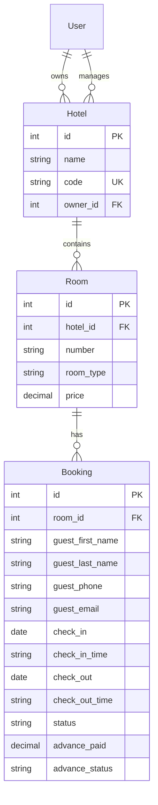

# Front Desk Booking Calendar Grid & Scheduler

An interactive hotel management system featuring a Django REST API backend and a Vite-React frontend.

---

## Project Overview

The application includes two main modules:
- **Room Module**: Manages room details such as room number, room type, category, pricing, and minimum advance amount.
- **Booking Module**: Manages guest information, check-in and check-out dates/times, booking status, advance paid amount, and advance payment status.

The system supports the following booking statuses:
- `Hold`
- `Temp Reserve`
- `Reserve`
- `Checked-In`
- `Checked-Out`

When a booking is marked as `Checked-Out`, the room becomes immediately available for new reservations.

---

## Database Structure & Schema

The database is structured into three primary tables: `Hotel`, `Room`, and `Booking`, mapped with Django model relationships.



### 1. Hotel Model (`api_hotel`)
Stores property registration profiles and user mapping.
- `name`: CharField (e.g. Abhirami Hotel)
- `code`: CharField (Unique index, e.g. `ABH01`, `ABL02`)
- `owner`: ForeignKey to User
- `managers`: Many-to-Many field to User

### 2. Room Model (`api_room`)
Represents individual rental rooms in properties.
- `hotel`: ForeignKey to Hotel (CASCADE)
- `number`: CharField (e.g. `STD-101`, `DLX-116`, `SUP-131`)
- `room_type`: CharField (Choices: `Standard`, `Deluxe`, `Superior`)
- `price`: DecimalField (Nightly rate in ₹)
- *Unique constraint*: `('hotel', 'number')` to prevent duplicates.

### 3. Booking Model (`api_booking`)
Stores active and historical stays.
- `room`: ForeignKey to Room (CASCADE)
- `guest_first_name`: CharField
- `guest_last_name`: CharField
- `guest_phone`: CharField (validated exactly 10 digits)
- `guest_email`: EmailField (Optional)
- `check_in`: DateField
- `check_in_time`: CharField (Default: `'12:00 PM'`)
- `check_out`: DateField
- `check_out_time`: CharField (Default: `'12:00 PM'`)
- `status`: CharField (Choices: `Hold`, `Temp Reserve`, `Reserve`, `Checked-In`, `Checked-Out`)
- `advance_paid`: DecimalField
- `advance_status`: CharField (Choices: `Paid`, `Unpaid`. Bypass min check if `'Unpaid'`)

---

## API Specifications

- **GET `/api/my-hotel/rooms/`** – Retrieves room details, category pricing, and minimum advance requirements.
- **GET `/api/my-hotel/bookings/`** – Retrieves active bookings.
- **POST & PUT `/api/my-hotel/bookings/`** – Create and update booking details.

The booking endpoints return the complete booking object, including:
- `"room_id"`
- `"room_number"`
- `"room_type"`
- Guest details (first name, last name, phone, email)
- Check-in and check-out dates & times
- Booking status
- Advance paid amount (defaults to `0.00` if `'Unpaid'`)
- Advance payment status (`Paid` or `'Unpaid'`)

---

## Quick Start Guide

### 1. Backend Setup (Django)
```bash
cd backend
# Create environment and install dependencies
python -m venv .venv
.venv\Scripts\activate
pip install -r requirements.txt

# Run migrations and seed DB
python manage.py makemigrations
python manage.py migrate
python manage.py seed_data

# Start server
python manage.py runserver 127.0.0.1:8000
```

### 2. Frontend Setup (React)
```bash
cd frontend
# Install and run Vite dev server
npm install
npm run dev
```
Open [http://localhost:5173/](http://localhost:5173/) or the displayed port in your browser.
